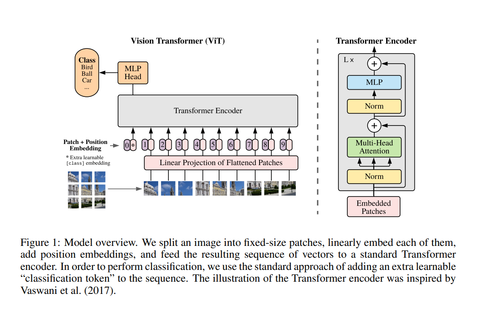
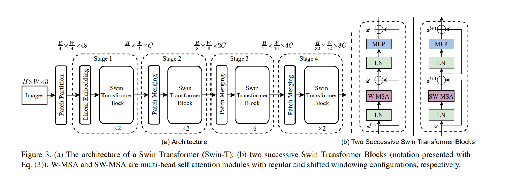

# vit

## vision transformer




## Swin Transformer


```
@misc{dosovitskiy2021imageworth16x16words,
      title={An Image is Worth 16x16 Words: Transformers for Image Recognition at Scale}, 
      author={Alexey Dosovitskiy and Lucas Beyer and Alexander Kolesnikov and Dirk Weissenborn and Xiaohua Zhai and Thomas Unterthiner and Mostafa Dehghani and Matthias Minderer and Georg Heigold and Sylvain Gelly and Jakob Uszkoreit and Neil Houlsby},
      year={2021},
      eprint={2010.11929},
      archivePrefix={arXiv},
      primaryClass={cs.CV},
      url={https://arxiv.org/abs/2010.11929}, 
}

@misc{liu2021swintransformerhierarchicalvision,
      title={Swin Transformer: Hierarchical Vision Transformer using Shifted Windows}, 
      author={Ze Liu and Yutong Lin and Yue Cao and Han Hu and Yixuan Wei and Zheng Zhang and Stephen Lin and Baining Guo},
      year={2021},
      eprint={2103.14030},
      archivePrefix={arXiv},
      primaryClass={cs.CV},
      url={https://arxiv.org/abs/2103.14030}, 
}
```